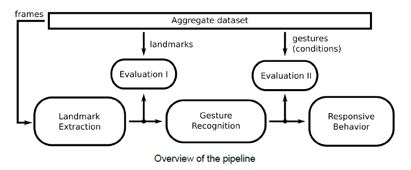

# Interactive Intelligent System Project. @Uppsala University
 
## Description
The goal of the project is to develop a system that takes as input a video of a user showing different hand gestures and shows a virtual agent reacting to these gestures.
An overview of the pipeline is shown in the figure below.

The pipeline can be split into three different sub-systems:

- **Landmark extraction (Subsystem 1)**: the first sub-system, automatically finds the location of all landmarks present in a given frame. 
    To evaluate this sub-system (Evaluation 1) the dataset used is a set of videos and a .csv file containing the landmark position.
    
- **Gesture Recognition (Subsystem 2)**: It takes as input a set of landmark locations (some of which can be (0,0) if the landmark is not present) 
    and outputs the detected hand gesture.

- **Responsive Behavior (Subsystem 3)**: It takes as input the detected gesture and shows the response of a virtual agent to that gesture.
    The virtual agent used is Furhat (https://furhatrobotics.com/furhat-sdk/).

- **End-to-End learning (Specialization)**: Instead of separating the first and second sub-system and training separate models for each, 
    combine both into a single system that predicts the shown gesture from raw images. 
    
For getting input to Furhat:  
run `action.py`  
  
Use the following integers as input to output hand gestures:  
   0: Open palm  
   1: Open dorsal  
   2: Fist palm  
   3: Fist dorsal  
   4: Three fingers palm  
   5: Three fingers dorsal  
   6: Failed hand gesture

Authors: Elvis Rodas [@dikioth](https://github.com/dikioth), Shafi Miah [@ShafiMiah](https://github.com/ShafiMiah), Clément Ribes [@Clem2798](https://github.com/Clem2798), hannes Simmonsson [@hannesSimonsson](https://github.com/hannesSimonsson). 
